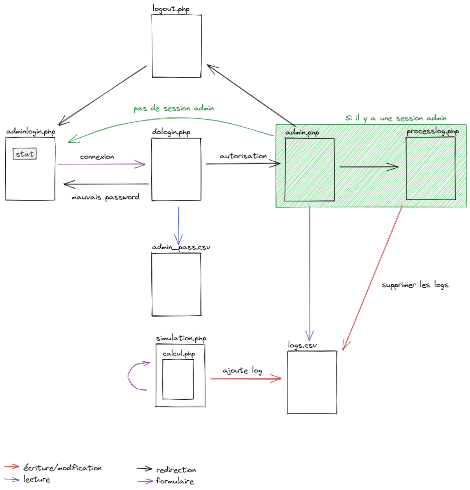

# Bank-account-php

Ceci est la documentation de notre projet PHP

## Table des matières

- [Utilisation](#Utilisation)
    - [Simulation](#Simulation)
    - [Partie Administrateur](#Partie-Administrateur)
- [Architecture](#Architecture)
    - [Description](#Description)
    - [Schéma](#Schéma)

## Utilisation

### Simulation

Il suffit d'aller sur la page simulation.php, ou trois champs sont disponibles

- **Capital**
- **Mois**
- **Taux** (en pourcentage)

Il faut ensuite cliquer sur le bouton **Calculer** et le résultat s'affichera en dessous du bouton, en vert.

Pour voir les 10 dernières simulations, il y a un bouton **Historique** en dessous de l'encadré principal. Il permet de
faire apparaitre un pop-up modal contenant l'historique.

### Partie Administrateur

Pour se connecter en tant qu'administrateur, il faut aller sur la page `adminlogin.php`. Il faut ensuite remplir les
champs **Login** et **Password** et cliquer sur *Connexion*.

La page `admin.php` permet de voir l'historique des transactions effectuées depuis le dernier archivage.

Elle permet aussi de vider le fichier d'historique (`logs.csv`)
ou de l'archiver (c'est-à-dire le renommer en un autre nom de fichier disponible, du type `logs.csv.2`)

Un bouton **Déconnexion** est aussi présent

## Architecture

### Description

Si dessous la liste des fichiers php et leur utilité

#### simulation.php

Page principale qui permet de remplir le formulaire pour la simulation et de consulter l'historique. L'action du
formulaire est non déportée et les fonctions permettant de réaliser le calcul sont dans `calcul.php` et importées
via `require`
Les parameters GET utilisés sont

- **stat** (pour afficher un message d'erreur)
- **capital**
- **mois**
- **taux**

#### calcul.php

Contient les fonctions de calcul de prêt et d'écriture dans les logs

#### adminlogin.php

Page de formulaire de connexion administrateur

Elle utilise le paramètre GET **stat** pour afficher un message d'erreur ou de déconnexion réussie

Elle envoie les paramètres POST **login** et **password** a la page `dologin.php` pour réaliser la connexion.

#### dologin.php

Page qui vérifie les identifiants administrateur

Elle utilise les paramètres POST **login** et **password** et les compares a ceux stockés dans `admin_pass.csv`.

Le mot de passe est hashé en sha256.

Si la connexion réussie, elle ouvre une session et met le champ de session `admin` a la valeur `admin` elle redirige
vers `admin.php`

Sinon, elle redirige vers `adminlogin.php?stat=1`

#### admin.php

Page d'administration

La page vérifie si le champ de session `admin` vaut bien `admin` et si non redirige vers `adminlogin.php?stat=1`

La page affiche l'historique contenu dans `logs.csv` sous forme de tableau

Elle contient les boutons **archiver** et **vider** qui redirigent vers `processlog.php?archiver`
et `processlog.php?vider` respectivement

Elle contient aussi un bouton de déconnexion qui redirige vers `logout.php`

#### processlog.php

Page servant à faire différentes opérations sur les logs (`logs.csv`)

Elle commence par vérifier si l'utilisateur est admin en vérifiant sir le champ de session `admin` vaut `admin`

Si ce n'est pas le cas elle redirige vers `adminlogin.php?stat=1`

Ensuite, si le paramètre GET **archiver** est présent, elle archive les logs ou si le paramètre GET **vider** est
présent elle les vide.

C'est expliqué dans la [partie Administrateur](#Partie-Administrateur)

Elle redirige ensuite vers `admin.php`

#### logout.php

Page de déconnexion

Elle détruit la session actuelle et redirige vers `adminlogin.php?stat=2`

#### logs.csv

Fichier de logs

Format :
| Adresse IP du client | Montant | Capital | Nombre de mois | Taux |
|----------------------|---------|---------|----------------|------|

#### admin_pass.csv

Fichier contenant les identifiants administrateurs

Format :
| Login | Mot de passe hashé en sha256 |
|-------|------------------------------|

### Schéma

